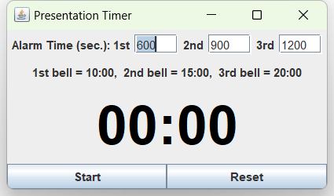

# PresentationTimer

学会等の発表会で，一定時間を経過するごとにベルを鳴らすためのタイマーソフトウェアです．
このソフトウェアを開発した2009年の時点で，「計測時刻に誤差がないこと」「秒単位でベル時刻が指定できること」という２つの条件を満たしたタイマーソフトウェアを発見できなかったために作成しました．


## Features

本ソフトウェアの機能は次の通りです．

 - 指定時刻にベル音を鳴らします．音が鳴らせるのは３回です．
 - 時間計測の開始／一時停止を行う「Start/Stop」ボタンと，停止中に時刻をリセットする「Reset」ボタンでタイマーを操作できます．
 - 表示する文字は，経過時間を表示する方式，カウントダウン方式の２種類をサポートしています．文字のサイズはウィンドウのサイズに合わせて自動調整しています（フォントの DPI 設定などが違う環境では正しく表示できないかもしれません）．
 - 表示する文字の色，背景色は変更することができます．




## 実行環境

Java Runtime Environment がインストールされた Windows を前提として開発しています．
Java の機能のみを使っていますので，他のプラットフォームでは動くかもしれませんが，動作確認は行っていません．


## 実行方法

JAR ファイルのダブルクリックで実行できます．デフォルトでは経過時間をカウントアップし，600秒，900秒，1200秒でベルが鳴る状態で起動します．

### 実行のカスタマイズ

コマンドライン引数によって，タイマーと色を変更することができます．
PresentationTimer クラスが起動用クラスです．
Windows では，付属バッチファイル timer.bat をコピーして，引数を適宜編集した上でご利用ください．
以下はコマンドライン引数の例です．

```
java -classpath bin jp.ac.osaka_u.ist.sel.timer.PresentationTimer 60 120 180 12d3U black/green/red<
```

この例では，60秒，120秒，180秒でベルを鳴らし，
1回目および2回目のベルが鳴るまでは残り時間をカウントダウン表示し，
それ以降は経過時間を表示します．
また，文字列は２回目のベルまでは黒，３回目のベルまで緑，それ以降は赤になります．

コマンドライン引数の順番，意味は次の通りです．

 - 第１引数から第３引数として，ベルの１回目，２回目，３回目を鳴らしたい時刻を，秒単位で指定してください．たとえば８分，１０分，１４分３０秒にベルを鳴らすには，480, 600, 870 という３つの数値を並べてください．
 - 第４引数は，各ベルまでの時刻表示を，経過時間と残り時間のどちらで表示するかを指定します．この文字列は正規表現でいうと `1[du]?2[du]?3[duU]` となります．
   - 1，2，3 の数字はベル番号を表現しており，後ろに &quot;u&quot; が付くと，そのベルまでは経過時刻をカウントしていくことになります．
   - &quot;d&quot; が付くと残り時刻をカウントダウンしていくことになります．
   - ３回目のベルが鳴った後は，&quot;d&quot; や &quot;u&quot; の場合は，鳴った後の経過時間を表示します．
   - ３回目のベルについて &quot;U&quot; が指定されていた場合は，その時刻までに行われていたカウントを，鳴った後も継続します．
 - 第５引数は，文字と背景の表示色です．第４引数で設定したベル音までの表示の区切りごとに，色を設定することができます．たとえば `123d` であれば３回目までのベル音が鳴るまでの文字色，３回目のベル音以降の文字色，そしてウィンドウの背景色が指定できます．ウィンドウの背景色は省略可能で（コマンドライン引数の例では指定していません），省略時はシステム標準の背景色が使用されます．
   - 色はすべて `;` で区切られた，色の名前の文字列です．大文字，小文字は区別しません．受け付ける色は，blue, black, cyan, darkgray, gray, green, lightgray, magenta, orange, pink, red, white, yellow です．

第4引数の詳しい例を以下に示します．

|設定値|動作                |
|:-----|:-------------------|
|123U  |開始からの経過時間を表示し続けます．第３ベルが鳴っても，カウントはリセットせず，継続します．|
|123d  |第３回ベルまでの残り時間をカウントダウン表示します．第３回ベルが鳴った時刻以降は，超過時間を表示します．|
|12d3U |開始から第２回ベルまで，残り時間をカウントダウン表示します．第２回ベルが鳴った時刻以降は，第２ベルからの経過時間を表示します．|
|12u3U |開始から第２回ベルまで，経過時間を表示します．第２回ベルが鳴った時点で，再度０からカウントしなおします．|


## 起動後の操作

 - 「Start」ボタンを押すとカウントが開始され，ボタンの表示が「Stop」に切り替わります．
 - 「Stop」ボタンを押すとカウントが停止します．もう一度「Start」を押すとカウントを再開します．
 - 停止状態のときに「Reset」を押すと，カウントが 0 に戻ります．

